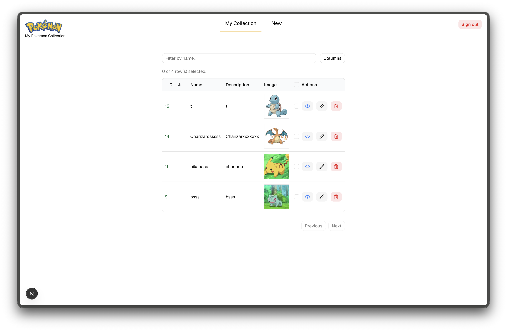

# Next Pokemon

A Next.js Pokemon collection app with authentication, image uploads, and CRUD flows for managing Pokemon records.



## Tech Stack

- Next.js 16 App Router
- React 19
- Prisma ORM with PostgreSQL
- Better Auth
- TanStack Query, TanStack Form, and TanStack Table
- shadcn/ui components
- AWS S3 presigned uploads

## Requirements

- Node.js
- pnpm
- PostgreSQL database
- AWS S3 bucket for Pokemon image uploads

## Environment Variables

Create a `.env` file in the project root with these variables:

```env
DATABASE_URL=

BETTER_AUTH_SECRET=
BETTER_AUTH_URL=http://localhost:3000

AWS_ACCESS_KEY_ID=
AWS_SECRET_ACCESS_KEY=
AWS_REGION=
AWS_S3_BUCKET=
```

Do not commit real `.env` values.

## Setup

Install dependencies:

```bash
pnpm install
```

Generate the Prisma client:

```bash
pnpm prisma generate
```

Apply database migrations:

```bash
pnpm prisma migrate dev
```

Start the development server:

```bash
pnpm dev
```

Open [http://localhost:3000](http://localhost:3000).

## Available Scripts

```bash
pnpm dev
pnpm build
pnpm start
pnpm lint
pnpm lint:fix
pnpm format
pnpm format:check
pnpm test
pnpm test:watch
```

## App Flow

1. Create an account or log in.
2. Open the Pokemon collection page.
3. Add a Pokemon with a name, description, and image.
4. View, edit, or manage Pokemon records from the table.

## Notes

- Pokemon images are uploaded through presigned S3 URLs.
- The Pokemon routes are protected and redirect unauthenticated users to the auth page.
- React Query caches Pokemon reads; mutations invalidate Pokemon queries after writes.
